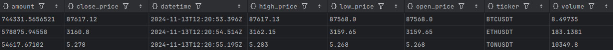
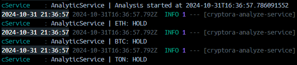
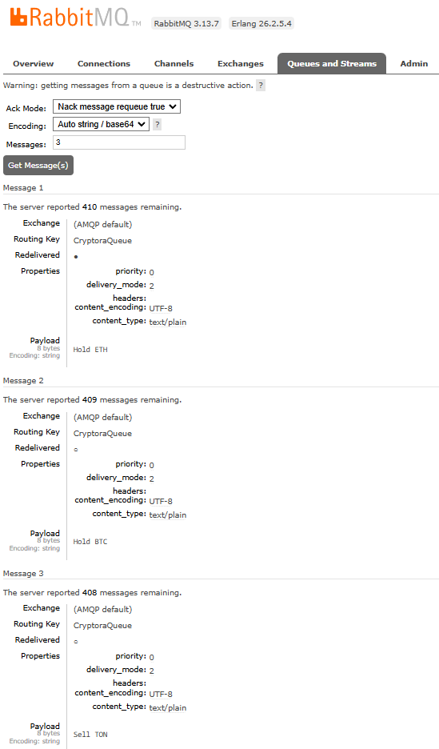

<div style="display: flex; flex-wrap: wrap; justify-content: center;">
    
    
</div>

## **Disclaimer**

**This service does not guarantee a 100% increase or decrease in cryptocurrency values.**
The service was developed solely by the author for educational purposes and should not be considered as financial
advice. The creator of this service is not responsible for any financial losses or damages incurred while using it.
Cryptocurrencies are highly volatile and carry inherent risks. Users should conduct their own research and consult with
a qualified financial advisor before making any investment decisions. By using this service, you acknowledge and accept
these risks.

---

## **Description**

**Cryptora-Analyze-Service**  is a Spring Boot application that retrieves cryptocurrency data from the Binance API and
analyzes it based on price fluctuations.
The service tracks price movements of various cryptocurrencies and assesses both short-term and long-term trends,
utilizing the Average True Range (ATR) with configurable periods and multipliers to enhance its insights.
A key advantage of this application is its ability to transmit data to other services or bots, such as Telegram,
using RabbitMQ, facilitating seamless integration and communication for generating trading signals (buy, sell, hold).

---

## **Key Features**

- **Real-time Data Fetching**: The application integrates with the Binance API to retrieve live cryptocurrency data.
  Users can track any available cryptocurrencies.

- **Cryptocurrency History Storage**: MongoDB is used to store the history of cryptocurrency prices, allowing users to
  analyze historical growth and decline trends.

- **Price Trend Analysis**: With stored price data, users can perform trend analysis on cryptocurrency growth and
  decline, supported by the Ta4j library.

- **Trading Signal Generation and Delivery**: Generated signals are sent via a RabbitMQ message queue, making it easy to
  connect and deliver this data to other services or end users.

---

## **Technologies**

- **Java**: The primary programming language.

- **Spring Boot**: Framework used for building the service.

- **MongoDB**: A NoSQL database used for storing real-time cryptocurrency quotes.

- **Binance API**: External API for retrieving up-to-date cryptocurrency price information in real-time.

- **Ta4j**: A library used for analyzing price movements, including growth and decline of cryptocurrencies.

- **RabbitMQ**: Message queue for asynchronous delivery of trading signals, enabling integration with other systems.

- **Docker**: Containerization platform that helps package the application with its dependencies, ensuring consistent
  environments and simplifying deployment.

---

## **How it Works**

### **Storing cryptocurrency data in a MongoDB**

After successfully retrieving data from the Binance API, all cryptocurrency information is stored in the database.



In the example above:

* Amount: The quantity of cryptocurrency involved in the transaction or trading period.
* Close price: The price at which the last trade was executed during the specified period.
* Date time: The timestamp in UTC format representing when the data was recorded.
* High price: The highest price reached during the specified time period.
* Low price: The lowest price reached during the specified time period.
* Open price: The price at which the first trade occurred during the specified period.
* Ticker: The symbol representing the cryptocurrency pair being traded.
* Volume: The total amount of cryptocurrency traded during the specified period.

### **Cryptocurrency Analysis**

The application, deployed in Docker, performs cryptocurrency analysis and provides recommendations,
such as "Buy", "Sell" or "Hold". The logs show the real-time analysis results for each cryptocurrency.



In the example above:

The analytic service starts the analysis and determines that for ETH, BTC, and TON,
the recommended actions is to sell BTC and hold ETC and TON.

### **RabbitMQ Message Queue**

After analysis, recommendations are sent to a RabbitMQ queue named CryptoraQueue. RabbitMQ is used to manage messages,
with each message representing a recommendation for a specific cryptocurrency. These messages can be processed by other
services subscribed to the queue.



The image above shows a queue with multiple messages:

* Message 1: Recommendation to Hold ETH.
* Message 2: Recommendation to Hold BTC.
* Message 3: Recommendation to Sell TON.

Each message contains additional attributes, such as priority, delivery_mode, and content_type, which allow the system
to handle them flexibly and provide recommendations in real time.

---

## **Installation Guide**

### **Prerequisites**

- Java 23
- Gradle 8.10.2
- Docker 27.2.0

### **Installation and Startup Steps**

1. **Clone the Repository**
   ```bash
   git clone https://github.com/dzenthai/Cryptora-Analyze-Service.git
   cd Cryptora-Analyze-Service
   ```

2. **Add Environment Variables**
   Create an .env file and add the required environment variables such as the Binance API key and secret.

3. **Build the Project Using Gradle**
   ```bash
   ./gradlew build
   ```

4. **Run the Application Using Docker**
   ```bash
   docker-compose up --build
   ```

---

## **Additional Information**

### **Adding or Changing Cryptocurrency**

To add new cryptocurrency, update the `Ticker` class by adding them to the Ticker enum:

```java
enum Ticker {
    BTC,
    ETH,
    TON,
    // add a new cryptocurrency here
}
```

### **Adjusting Data Fetching Interval**

To modify the interval at which the application fetches and analyzes price data, update the following line in
the `AppScheduler` class:

```java

@Scheduled(fixedRate = 10000) // Time is in milliseconds
public void executeInSequence() {
}
```

You can adjust the short-term and long-term periods for the moving average in `AnalyticService` using parameters in the
application.yaml file:

```yaml
cryptora:
  short:
    time:
      period: 50 #short-term
  long:
    time:
      period: 200 #long-term
  atr:
    period: 14 # atr period
    multiplier: 2.0 # atr multiplier
```

Also, it is recommended to adjust the duration in the `AnalyticService` class to match, as shown below:

```java
private Bar buildBar(ZonedDateTime endTime, Quote quote) {
    return new BaseBar(
            Duration.ofHours(1) // Also supports setting in seconds, minutes, days, etc.
            // Other settings...
    );
}
```
